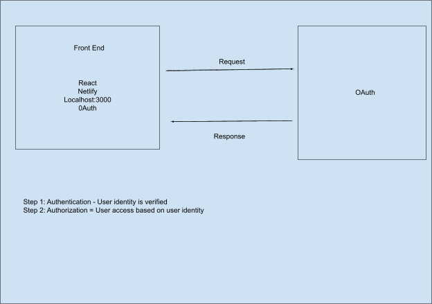

# best-books-front-end

**Author**: Elijah Prom, Ellis Yoo

**Version**: 1.0.0 (increment the patch/fix version number if you make more commits past your first submission)

## Overview

<!-- Provide a high level overview of what this application is and why you are building it, beyond the fact that it's an assignment for this class. (i.e. What's your problem domain?) -->

Create a bookshelf site

## Getting Started

<!-- What are the steps that a user must take in order to build this app on their own machine and get it running? -->

Dependencies needed

- @auth0/auth0-react
- bootstrap
- react
- react-bootstrap
- react-router-dom

## Architecture

<!-- Provide a detailed description of the application design. What technologies (languages, libraries, etc) you're using, and any other relevant design information. -->

Implementing React and Node.js

## Change Log

<!-- Use this area to document the iterative changes made to your application as each feature is successfully implemented. Use time stamps. Here's an example:

01-01-2001 4:59pm - Application now has a fully-functional express server, with a GET route for the location resource. -->

### Name of feature: Set up your front-end repository

Estimate of time needed to complete: 30 min

Start time: 1 pm

Finish time: 1:45 pm

Actual time needed to complete: 45 min

### Name of feature: Authentication

Estimate of time needed to complete: 1.5 hrs

Start time: 2 pm

Finish time: 3:30 pm

Actual time needed to complete: 1.5 hrs

### Name of feature: connect front end to back end

Estimate of time needed to complete: 2 hours

Start time: 2:30pm

Finish time: 5:30 pm
Actual time needed to complete: 3hrs

### Name of feature: Authentication

## Credit and Collaborations

### Logistical

- What hours will you be available to communicate?
  1300 - 2100
- What platform will you use to communicate (ie. Slack, phone …)?
  Slack & Remo
- How often will you take breaks?
  Every hour with 10 min breaks
- What is your plan if you start to fall behind?
  Reach out to TAs and instructors for help.

### Cooperative

- Make a list of each parson’s strengths.
  Ellis: front-end design, debugging
  Eli: ideas, brainstorming, knowledge based on JavaScript
- How can you best utilize these strengths in the development of your application?
  Teaching each other our strengths. Eli can navigate and create ideas and Ellis can design most of the front-end side and look for bugs
- In what areas do you each want to develop greater strength?
  Eli: Get more basic knowledge in code
  Ellis: Get better on communicating with partners
- Knowing that every person in your team needs to understand the code, how do you plan to approach the day-to-day development?
  Make sure each person understands the flow of the code and ask questions when not understood.

### Conflict Resolution

- What will your team do if one person is pulling all the weight while the other person is not contributing?
  Suggest one another to contribute by dividing driver/navigator roles.
- What will your team do if one person is taking over the project and not letting the other member contribute?
  Be open towards each other and as above divide roles.
- How will you approach each other and the challenge of building an application knowing that it is impossible for two people to be at the exact same place in understanding and skill level?
  Take the time to explain when another is lost.
